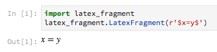

latex_fragment
===============================

You are writing your code using jupyter_ or pweave_,
but your colleague freaks out because it's not using 
*that one special latex thing that we totally need or it's not real science*.
(Let's say it's ``\algorithmic``, say, because this problem is alrady solved for 
mathematical markup thanks to MathJax_ and Katex_.)

No problem.

.. code:: python

    import latex_fragment
    latex_fragment.LatexFragment(r'$x=y$')

This will render just fine, using your sytem LaTeX.

.. _mathjax: https://www.mathjax.org/
.. _katex: https://github.com/Khan/KaTeX
.. _jupyter: https://jupyter.org/
.. _pweave: http://mpastell.com/pweave/