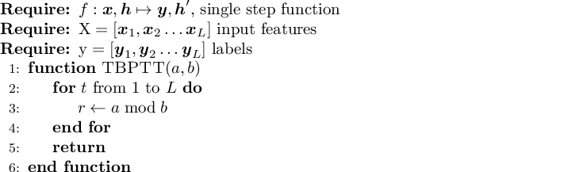

latex_fragment
===============================

You are writing your code using jupyter_ or pweave_,
but your colleague freaks out because it's not using 
*that one special latex thing that we totally need or it's not real science*.
(Let's say it's ``\algorithmic``, say, because this problem is alrady solved for 
mathematical markup thanks to MathJax_ and Katex_.)

No problem.

.. code:: python

    import latex_fragment
    latex_fragment.LatexFragment(r'$x=y$')

This will render just fine, using your sytem LaTeX.

.. image:: screenshot.png

Fancier:

.. code:: python

    import latex_fragment
    latex_fragment.LatexFragment(r'''
    \usepackage{algorithmicx}
    \usepackage{algpseudocode}
    \begin{algorithmic}[1]
        \Require $f:\boldsymbol{x},\boldsymbol{h}\mapsto \boldsymbol{y},\boldsymbol{h}',$ single step function
        \Require $\textrm{X}=[\boldsymbol{x}_1, \boldsymbol{x}_2\dots\boldsymbol{x}_L]$ input features
        \Require $\textrm{y}=[\boldsymbol{y}_1, \boldsymbol{y}_2\dots\boldsymbol{y}_L]$ labels
        \Function{TBPTT}{$a,b$}
            \For{$t$ from $1$ to $L$}
                \State $r\gets a \bmod b$
            \EndFor
            \State \textbf{return}
        \EndFunction
    \end{algorithmic}''')

.. _mathjax: https://www.mathjax.org/
.. _katex: https://github.com/Khan/KaTeX
.. _jupyter: https://jupyter.org/
.. _pweave: http://mpastell.com/pweave/