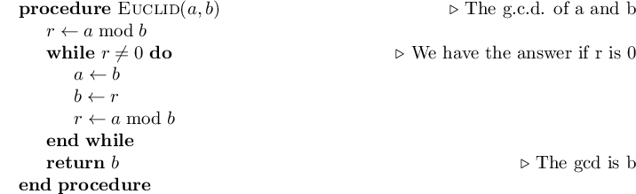

latex_fragment
===============================

You are writing your code using jupyter_ or pweave_, but your colleague freaks
out because it's not using *that one special latex thing that we totally need or
it's not real science*. (Let's presume it is, say, ``\algorithmic``, because
this problem is already solved for mathematical markup thanks to MathJax_ and
Katex_.)

No problem.

.. code:: python

    import latex_fragment
    latex_fragment.LatexFragment(r'$x=y$')

This will render just fine, using your system LaTeX.

.. image:: screenshot.png

Fancier:

.. code:: python

    import latex_fragment
    latex_fragment.LatexFragment(r'''
    \usepackage{algorithmicx}
    \usepackage{algpseudocode}
    \begin{algorithm}
    \caption{Euclid’s algorithm}\label{euclid}
    \begin{algorithmic}[1]
    \Procedure{Euclid}{$a,b$}\Comment{The g.c.d. of a and b}
        \State $r\gets a\bmod b$
        \While{$r\not=0$}\Comment{We have the answer if r is 0}
            \State $a\gets b$
            \State $b\gets r$
            \State $r\gets a\bmod b$
        \EndWhile\label{euclidendwhile}
        \State \textbf{return} $b$\Comment{The gcd is b}
    \EndProcedure
    \end{algorithmic}
    \end{algorithm}
    ''')

If you want it to display as an image, e.g. Pweave output, you can use the
ipython display infrastructure:

.. code:: python

    from IPython.display import display
    import latex_fragment
    l = latex_fragment.LatexFragment(r'$x=y$')
    display(l)

Or, save it as an image:

.. code:: python

    from IPython.display import display
    import latex_fragment
    l = latex_fragment.LatexFragment(r'$x=y$')
    display(l)

.. _mathjax: https://www.mathjax.org/
.. _katex: https://github.com/Khan/KaTeX
.. _jupyter: https://jupyter.org/
.. _pweave: http://mpastell.com/pweave/